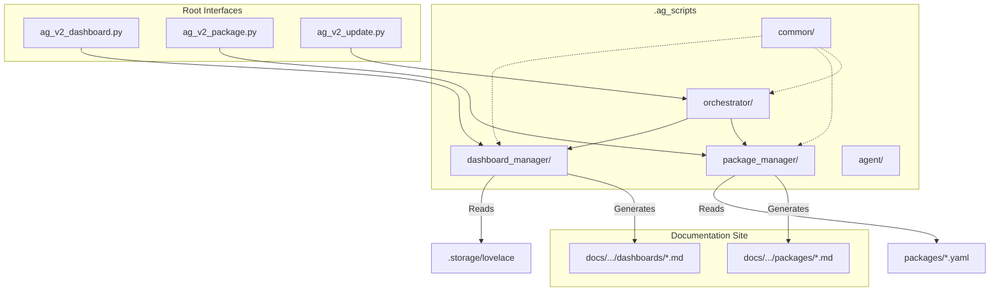

---
tags:
  - meta
  - architecture
  - manual
---

# Documentation System Architecture

**Philosophy:** "Everything as Code"
**Status:** Self-Validating & Modular
**Version:** 2.1 (Clarified Manual Steps)

## 1. The Core Concept
Unlike traditional wikis where documentation is written manually and eventually goes stale, **EvisHomeLab** uses an **Agentic Documentation System** approach.

The documentation is not just text; it is the output of an **Orchestration Engine**. We treat documentation updates exactly like software deployments: **Source -> Build -> Deploy**.

### The "Modular Package" Architecture
To prevent data loss and ensure maintainability, we use a standard Python package structure (`.ag_scripts`).



## 2. The Toolchain (V2)

### A. The Directory Structure
The system is organized to keep logic (`.ag_scripts`) separate from content (`packages/`, `docs/`).

```text
/config
├── .ag_scripts/            # [NEW] The Brain (Python Logic)
│   ├── common/             # Shared Utils & Privacy Map
│   ├── dashboard_manager/  # Dashboard Logic
│   ├── package_manager/    # Package Logic
│   └── orchestrator/       # Update Logic
├── ag_v2_dashboard.py      # Shim Script
├── ag_v2_package.py        # Shim Script
├── ag_v2_update.py         # Shim Script
├── packages/               # Source: YAML Packages
├── .storage/               # Source: JSON Dashboards (Hidden)
└── docs_site/              # Output: The Documentation Web Site
    ├── docs/
    └── mkdocs.yml
```

### B. The Orchestrator (`ag_v2_update.py`)
The master controller.
* **Function:** Calls the specialized modules to update the entire system.
* **Architecture:** Just a shim that calls `.ag_scripts.orchestrator.update_all`.

### B. Dashboard Manager (`ag_v2_dashboard.py`)
* **Source:** `.ag_scripts/dashboard_manager/`
* **Input:** `.storage/lovelace` (Main) & `.storage/lovelace_dashboards`.
* **Output:** `docs/smart-home/dashboards/[slug]/[view].md`.
* **Features:**
    * **Preservation:** Keeps manually written summaries.
    * **Linking:** Auto-links packages.
    * **Privacy:** Redacts names via `common/privacy.py`.

### C. Package Manager (`ag_v2_package.py`)
* **Source:** `.ag_scripts/package_manager/`
* **Input:** `packages/*.yaml`.
* **Output:** `docs/smart-home/packages/*.md`.
* **Features:**
    * **Stale Detection:** Warns if documentation version < code version.
    * **Injection:** Fills slots (`<!-- START_SUMMARY -->`) with content.

### D. AI Agent Helper (`ag_v2_agent.py`)
* **Function:** Generates prompts for the IDE AI to write documentation.
* **Context:** Reads YAML and MD to give the AI full context.

## 3. The Workflow (How we work)

We edit the **Python Modules** in `.ag_scripts/`.

| Goal | Action |
| :--- | :--- |
| **Update Logic** | Edit `.ag_scripts/[module]/*.py` |
| **Update Privacy** | Edit `.ag_scripts/common/privacy.py` |
| **Update Dashboards** | `python ag_v2_dashboard.py` |
| **Update Packages** | `python ag_v2_package.py --all` |
| **Full Update** | `python ag_v2_update.py` |

## 4. Safety Features

1.  **Modular Isolation:** Logic is separated into modules (Python Packages) rather than monolithic scripts, preventing side-effects.
2.  **Git-Backed:** We rely on Git for versioning and backups.
3.  **Preservation:** The Dashboard Manager specifically reads existing Markdown to preserve manual summaries before regenerating the structure.

## 5. How to Use (Quick Start)

Here is how you actually run the tools in your daily workflow.

### Scenario 1: I just updated a package
You changed `packages/car.yaml` and want to see the docs update.
```powershell
python ag_v2_package.py car
```
*   **What it does:** Reads `car.yaml`, updates `docs/smart-home/packages/car.md`.

### Scenario 2: I added a new view to my dashboard
You edited the dashboard in the UI. Now you want the docs to match.
```powershell
python ag_v2_dashboard.py
```
*   **What it does:** Scans your Lovelace config, anonymizes names, and rebuilds the dashboard docs.

### Scenario 3: I want the AI to analyze my code
You want the AI (in VS Code) to write a summary for you.
```powershell
python ag_v2_agent.py car
```
*   **What it does:** Generates a "Prompt" that you can copy-paste to your AI Assistant to get a perfect analysis.

### Scenario 4: I want to update EVERYTHING
You are done for the day and want to sync up.
```powershell
python ag_v2_update.py
```
*   **What it does:** Runs all of the above in sequence.
