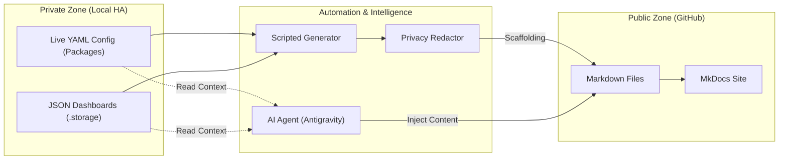

# Documentation Architecture & Workflow

This article details the technical implementation of the **EvisHomeLab** Home Assistant documentation. It explains the "Detached Docs" strategy, the automation machinery that generates it, AI content injection, and how we ensure privacy and security.

## Summary (Non-Technical)

**What This System Achieves**
This system solves the "Stale Documentation" problem by treating documentation as living code. Instead of relying on humans to remember to update a wiki every time they change a configuration, our "Agentic" system automatically regenerates the manual from the actual source code. This ensures that the public documentation website always reflects the reality of the Home Lab, while strictly preserving privacy by redaction of names and secrets. It transforms a private, messy technical setup into a polished, public-facing product showcase.

**How It Actually Works**
Think of the system as a "Secure Publishing Bridge". On one side is your private Home Assistant server, with some privacy-security-sensitive data (names, MAC addresses, etc.). On the other side is the public internet. Our automation scripts act as the bridge: they read the private data, "sanitize" it (anonymizing names, api keys, passwords, etc.), format it into readable articles, and then push only the clean, safe version to GitHub. This works in two steps: first creating the document md file with the code and placeholders for screenshots, AI summaries, descriptions, diagrams, and the letting AI read through the code and actually generate the summaries, descriptions, and diagrams. This way the documentation is always up to date and accurate and the format is consistent

**Future Improvements (Roadmap)**
While currently robust, we have exciting ideas for "V3". I'm thinking to implement **AI-Generated Changelogs**, where the system explains *why* a change was made, not just *what* changed. We also thinking to add **Automated Screenshotting**, using a headless browser to take real photos of dashboards during the build process, replacing the current manual "Drop & Link" method.


## 1. The "Detached Docs" Strategy

The core architectural decision of this project is the **separation of concerns** between the live system and the public documentation.

### The Problem
Home Assistant's configuration (`/config`) is full of sensitive data:
- `secrets.yaml` (passwords, tokens)
- `known_devices.yaml` (MAC addresses)
- `home-assistant_v2.db` (detailed usage history)
- Personal entity IDs (e.g., `device_tracker.jukka_iphone`)

Pushing the entire `/config` folder to GitHub, even with `.gitignore`, is high-risk. Accidental leakage of `secrets.yaml` or personal data is catastrophic.

### The Solution
We maintain **two separate repositories**:

1.  **Private Config (Local Only):**
    -   Location: `z:\` (The root `/config` folder)
    -   Contains: Live YAML, databases, logs, original scripts.
    -   **NEVER pushed to GitHub.**

2.  **Public Docs (Remote):**
    -   Location: `z:\docs_site`
    -   Contains: Sanitized Markdown, diagrams, and assets.
    -   **Pushed to [GitHub EvisHomeLab](https://github.com/EvisHome/EvisHomeLab).**

The "Bridge" between these two worlds is our **Automation Layer**.



## 2. The Automation Machinery

We do not write most of the documentation manually. Instead, we **generate** it from the live configuration to ensure it never goes stale.

The tooling is built as a modular Python package located in `z:\.ag_scripts`.

### 2.1 Entry Point
The main entry point for the user is the update script in the root directory:

```bash
python ag_v2_update.py
```

This script bootstraps the `orchestrator` module, which runs the generation pipeline.

### 2.2 Key Modules

*   **`common/privacy.py`**: The **Single Source of Truth** for redaction. It defines a strict mapping (regex patterns) to sanitize data *before* it is written to the `docs_site` folder.
    *   `Jukka` -> `Evis`
    *   `"name"` -> `Daughter`
    *   License Plates -> `[LICENSE_PLATE]`

*   **`dashboard_manager/`**: Reads the hidden `.storage/lovelace.*` JSON files.
    *   Converts JSON to **YAML Block Style** (for readability).
    *   Applies redaction.
    *   Generates `docs/smart-home/dashboards.md` with "Drop & Link" placeholders for screenshots.

*   **`package_manager/`**: Scans the `packages/` directory.
    *   Parses YAML to understand the package structure.
    *   **Dependency Lookup:** Automatically scans all Dashboard documentation to find where package entities are used ("Reverse Dependency Search").

    *   Generates "Executive Summaries" and wiring diagrams.
    *   Updates `docs/smart-home/packages/*.md`.

### 2.3 The "Magic": AI Intelligence Injection

While the Python scripts handle the **Scaffolding** (creating files, basic headers, standard layouts), they cannot understand *context*. This is where the **AI Agent** (Google Antigravity) steps in to perform the "Intelligence Injection".

This is the two-step dance:

1.  **The Scripts Build the Skeleton:**
    The `ag_v2_package.py` script creates the Markdown file and inserts "Slots" (HTML comments) for content:
    ```html
    <!-- START_SUMMARY -->
    *No summary generated yet.*
    <!-- END_SUMMARY -->
    ```

2.  **The AI Fills the Brains:**
    You (the developer) ask the AI to "Analyze the Car Package". The AI then:
    *   **Reads the Code:** Scans the raw YAML to understand logic flow.
    *   **Identifies Dependencies:** Distinguishes between a simple `input_boolean` (internal helper) and a complex `mqtt` sensor (External Integration).
    *   **Generates Diagrams:** Writings `Mermaid JS` sequence diagrams that visually explain how the automation works.
    *   **Writes the Narrative:** Replaces the empty placeholders in the Markdown file with human-readable "Executive Summaries" and "Process Descriptions".

This hybrid approach gives us the best of both worlds: **Machine consistency** (files always exist, navigation is always correct) + **Human-like understanding** (explanations that actually make sense).

## 3. The Build Pipeline (MkDocs)

Once the Markdown files are generated in `docs_site/`, we use **MkDocs** with the **Material** theme to build the static site.

### Configuration (`mkdocs.yml`)
We use a feature-rich configuration to create a "Premium" feel:

*   **Navigation**: `awesome-pages` plugin automatically builds the sidebar from the folder structure.
*   **Admonitions**: `!!! info` blocks for architectural alerts.
*   **Mermaid**: Verified support for rendering sequence diagrams.
*   **Hooks**: A custom `hooks/hide_drafts.py` script runs during the build to exclude any file marked with `draft: true` in its frontmatter.

## 4. Safety Logic: Stale Documentation Detection

A key fear with automated docs is that the code changes (e.g., v1.1) but the human-written/AI-generated explanations (written for v1.0) remain, becoming misleading.

We implemented a **Version Integrity Check** to solve this:

1.  **Code Versioning:** We enforce a `Version: X.X.X` tag in the header of every YAML package file.
2.  **Comparison:** When the update script runs, it compares the **Code Version** against the **Documentation Version** in the Markdown frontmatter.
3.  **Warning Injection:** If a mismatch is detected (e.g., Code is v1.2, Docs are v1.1), the system does **not** overwrite the manual explanations. Instead, it **injects a warning** into every text section:
    > ⚠️ **Update Required:** Analysis for v1.1. Code is v1.2.

This ensures that a user reading the docs knows *immediately* that the explanation might be slightly out of date, prompting a new AI analysis cycle.


## 5. Maintenance Workflow

We divide the documentation into two distinct zones:

### Zone A: Manual Documentation (Guides & Manuals)
*   **Locations:** `/docs/network/`, `/docs/articles/`, root `/docs/`
*   **Workflow:**
    1.  User creates `.md` files manually.
    2.  User writes content (guides, SOPs, articles), while AI can be used to generate summaries and assist with content.
    3.  **No automation touches these files.**

### Zone B: Automated Documentation (Smart Home Specs)
*   **Locations:** `/docs/smart-home/packages/`, `/docs/smart-home/dashboards/`
*   **Workflow:**
    1.  **NEVER create files manually here.**
    2.  Run `python ag_v2_update.py`. The scripts will generate the files/indexes.
    3.  **AI Injection:** The AI then fills in the content slots (`<!-- START_SUMMARY -->`) inside these generated files.
    4. User can review and edit the generated content.

### Updating Configuration (Automated)
1.  Make changes to your Home Assistant YAML or Dashboards.
2.  Run the update tool:
    ```powershell
    python ag_v2_update.py
    ```
3.  The scripts will regenerate the relevant docs.
4.  Git Commit & Push:
    ```powershell
    cd docs_site
    git add .
    git commit -m "Update configuration specs"
    git push
    ```
5.  GitHub Actions detects the push and publishes the site to `www.evishome.com`.
